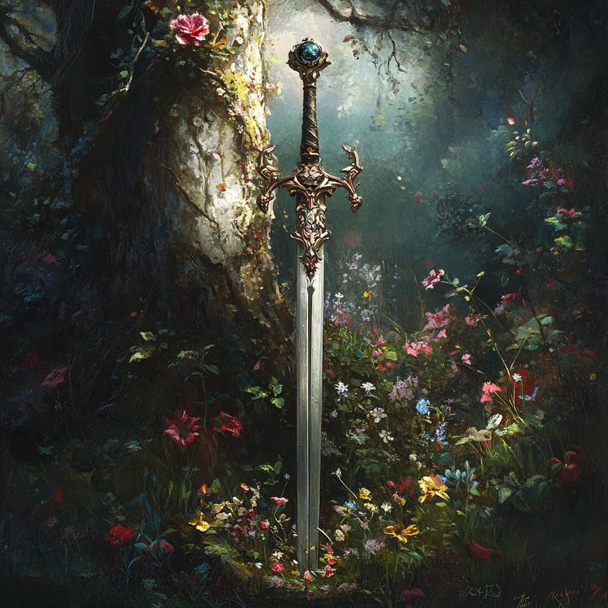

| ![[CaritasZespire.png\|200]] | ![[CaritasZespireFront.jpg\|200]] | ![[CaritasZespireSide.png\|200]] |
| ---------------------------- | :-------------------------------: | :------------------------------: |

 _Human Fighter / Young Reformer / Affluent and Carefree Playboy._ 
 
 Lord Caritas of House Zespire is perceived as a charming and somewhat irresponsible nobleman. Known for his affable nature, he frequently mingles with the city's elite and maintains a prominent public profile. Often seen in the company of beautiful women, his reputation as a playboy is well-established. 
 
 Though he appears aloof and unconcerned with serious matters, Caritas is deeply passionate about three things: wine, women, and warring—specifically, dueling. 
 
 While others may assume he wastes his time in frivolous pursuits, Caritas has dedicated countless hours to mastering the blade. 
 

Son of [[Vice Count René Malbec du Valle]] 

Resides in the [[City of Zimar]] in the Sophra Prefecture of the Glorian Empire
Attended the [[Gennaris Academy]]

Lineage [[House Zespire.canvas]]

core memories:
- Arturo punching one of the Marosett boys right in the nuts while yelling "self defense punch!"
- watches the merosett boys torturing Marsella
- watched the princess get pushed into the water feature
- watched the prince get slammed into the Pegasus statue
- is carried by René as the count is beating bartlebee as a result of the battle royale
- [[Prince Carrius Stavian - deceased]] dies at age 16 in an accident

Notable Inventory Items
- 1 smoke bomb
- the folio of [[Museta Zespire]]
	- written by [[Museta Zespire]] , it is essentially a planner.  She took an active role in planning senatorial stuff.  schedules, seating charts.  discovers several spell scrolls tucked into the back.  "blur", "confetti cloud", "charital urge", "haste", and "marvelous mount"

### Provenence

- Originally the sword of [[Vice Count René Malbec du Valle]]
- now carried by [[Caritas Zespire]] though the original glowing runes have faded since his father's death