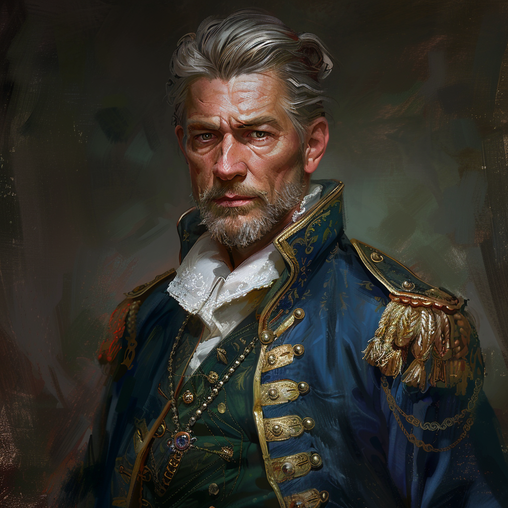

_He/Him_
An Ally of Viscountess Tirri Kastner-Caleo / possibly the whole party now
Uncle of Caritas Zespire
### Key Notes:
- competent, persistent, long history of navel service
### Can be influenced via
- Mercantile Lore
- Glorian Empire Lore
- Nature (is very interested in)
### Benefits
- can purchase items from him or by using his name
- Hobbies include
	- accidently stumbling upon pirates and dealing with them