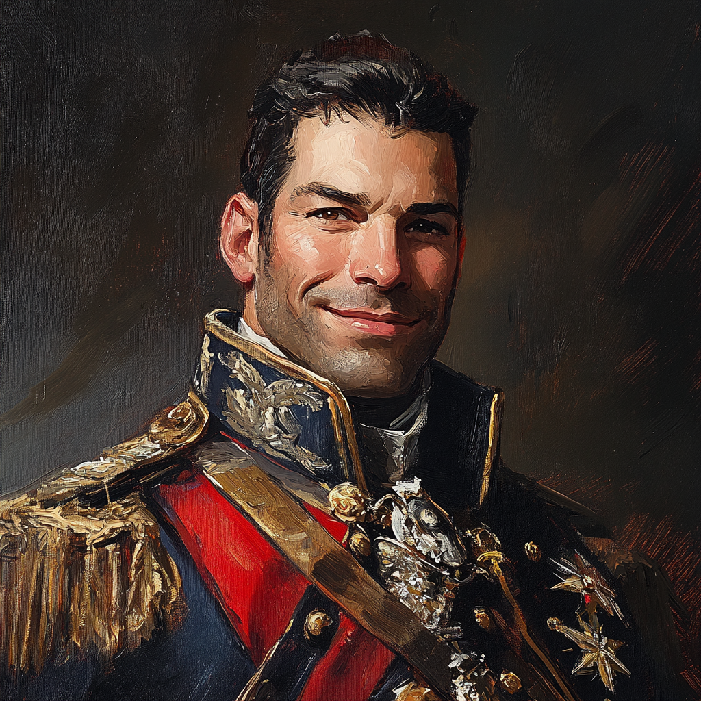
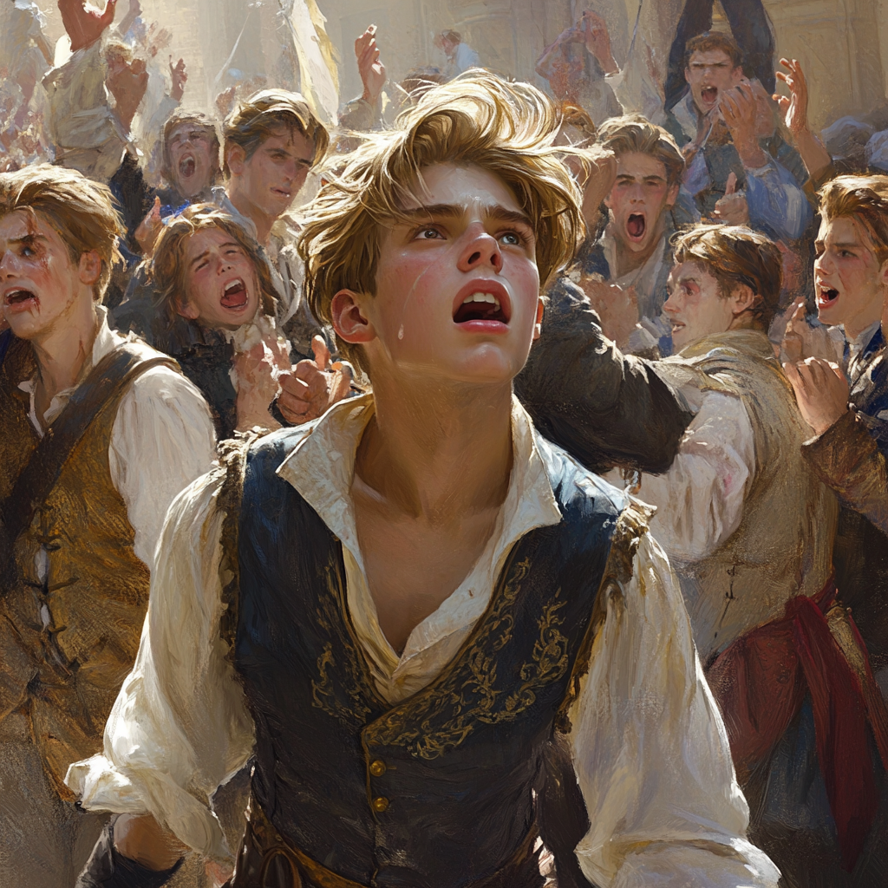

## Alignment
Lawful Good / Noble of Spirit

## Background
Rene is originally from the northern nation of Rysher. 
Came to Rosanna when he was young as the military protection for a Rysherin Diplomat, fell in love with Madeira Zespire, petitioned to be discharged from the Rysherin military, and became a Glorian citizen. Brought his talents to the Glorian Phalanx, because he has a calling of honor to serve.

## Residency:
- Home: City of Zimar
- The Zespire Vinyards are located in Tandak prefecture (near-ish the palace of birdsong)
## Featured Notes
- Commander of the BlackVine of the Glorian Phalanx
- Wielder of Provenance (his dueling cane / rapier)
- Champion of the Festival of Steel 
- Lone Survivor of the Trials of Valor
- Defeated Pythareus in a dual during Armasse Week
- executed for crimes against the empire (falsely-ish)

## Execution
